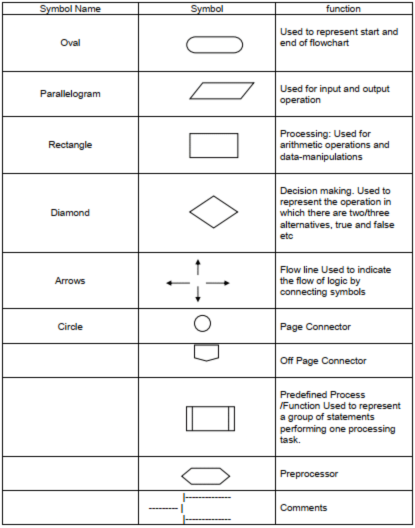

## FlowChart
A FlowChart is a visual representation of a program using diagrams and shapes that have a fixed meaning. It provides a graphical overview of the program's structure and flow. Here are some common symbols and their meanings in a FlowChart:

- **Eclipse**: Denotes the starting and end of the program.
- **Parallelogram**: Denotes input or output statements.
- **Rectangle**: Denotes calculations or arithmetic operations.
- **Rhombus**: Denotes decision or comparison statements.

Please refer to the attached image for a visual representation of the FlowChart.

## PseudoCode
PseudoCode is a way to express general instructions without using specific programming syntax. It serves as a high-level representation of a program's logic. PseudoCode can be easily converted into actual code once the algorithm is finalized. It helps in planning and designing the program's structure before implementation.

## Programming Languages and Compilers
Programming Languages are special languages that can be understood by computers. They have a specific syntax and structure. However, computers can only understand machine language consisting of 0s and 1s. To bridge this gap, compilers are used. A compiler is a program that converts code written in a programming language into machine-readable format.

The process involves writing code in a human-readable format using the syntax of a programming language. The code is then compiled by a compiler, which translates it into the corresponding machine instructions.

By using programming languages and compilers, we can harness the power of computers to perform calculations and execute complex tasks more efficiently than humans.

